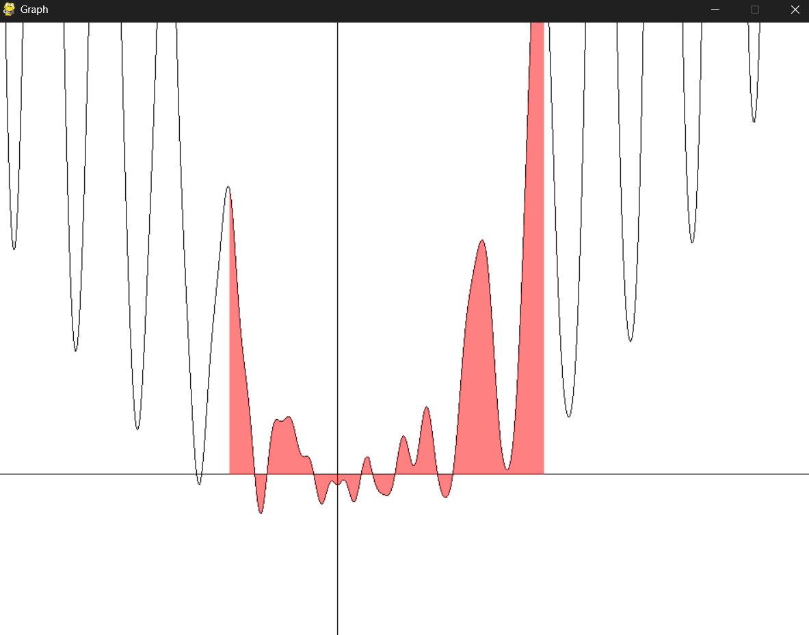
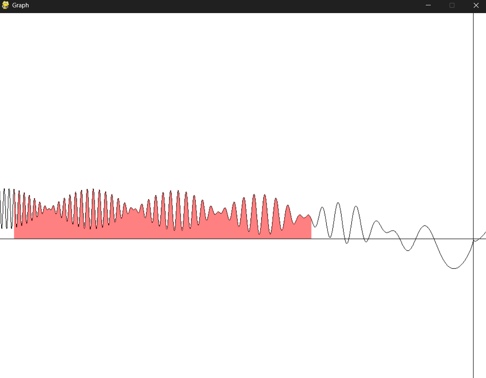
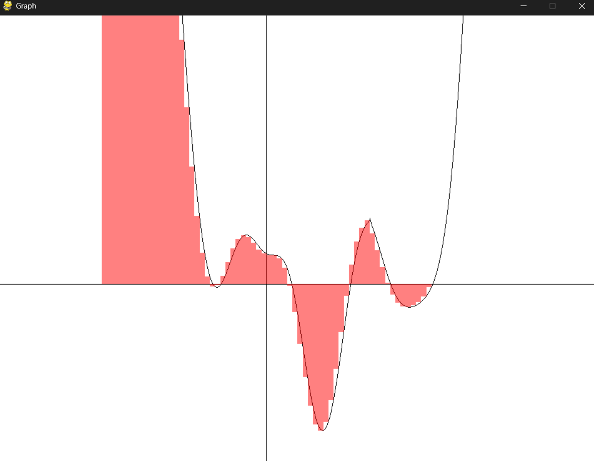

# Simple Graphing Calculator

A lightweight interactive graphing calculator built with Python, OpenGL, and symbolic math.

## Motivation

I built this project to bridge the gap between theoretical calculus and practical software implementation. My goal was to create a specialized, interactive graphing tool capable of visualizing the nuances of integral calculus—a task that requires both precision and performance.

Driven by a desire to look "under the hood" of tools like Desmos, I aimed to:

- Explore Numerical Integration: I wanted to move beyond the textbook definitions of Riemann sums and implement various estimation methods (e.g., Left, Right, Midpoint, and Trapezoidal rules) from scratch.

- Visual Intuition: I wanted to create a tool that allows for real-time manipulation of mathematical functions to visually demonstrate how different estimation methods converge or diverge as the number of intervals increases.


## What it does

- Renders mathematical functions in a window using `pygame` and `moderngl`.
- Plots function graphs in real time over a customizable coordinate range.
- Draws numeric integration approximations using Left/Right/Midpoint Riemann sums and the Trapezoidal Rule.
- Supports interactive zoom and pan controls, including mouse drag and mouse wheel zoom.
- Prints integration approximation values to the console on demand.

## Key features

- Function parsing via `sympy` for user-entered expressions.
- High-resolution graph sampling with configurable integration and graph density.
- Integration bounds can be shifted and adjusted while the graph renders.
- Visual integration area is colored differently depending on bound orientation.

## Requirements

- Python 3.10+ (recommended)
- `numpy`
- `sympy`
- `pygame`
- `moderngl`

## Installation

1. Activate your Conda environment:

```bash
conda activate <env_name>
```

2. Install the required packages:

```bash
pip install -r requirements.txt
```

## Usage

Run the calculator from the project root:

```bash
python -m src/run.py
```

Then enter a mathematical function when prompted.

## Controls

- `1`: Select Left Riemann Approximation
- `2`: Select Right Riemann Approximation
- `3`: Select Midpoint Riemann Approximation
- `4`: Select Trapezoidal Approximation
- `[` : Halve the number of integration samples
- `]` : Double the number of integration samples
- `o` : Print current integration approximations to the console
- `←`: Shift integration bounds left
- `→`: Shift integration bounds right
- `↓`: Shift the upper integration bound down
- `↑`: Shift the upper integration bound up
- `r` : Reset view and integration bounds to defaults

## Project structure

- `src/run.py` — main application and input handling
- `src/graph.py` — graph rendering logic
- `src/integration.py` — drawing integration approximation regions
- `src/calc.py` — numeric integration formulas
- `src/settings.py` — window and integration defaults
- `src/draw.vs` / `src/draw.fs` — GLSL shaders

## Challenges I faced

- Resolving errors with discontinuities and complex (invalid) numbers
- Projecting from math to screen coordinates
- Drawing the graph correctly despite zoooming in/out and moving the window

## Things I learned

- Using sympy to parse user math syntax
- Working with numpy to resolve issues involving complex and invalid numbers

## Example Images

```
(1/10)*(x**2-4*x+3)*exp(sin(x))+log(x**2+1)*cos(2*x)-sqrt(abs(x-pi))+atan(x)*sin(3*x)
```



```
sin(x)*cos(x**2)+log(x**2+1)-sqrt(abs(x))+x/(x**2+1)
```



```
(x**2-4*x+3)*exp(sin(x))+log(x**2+1)*cos(2*x)-sqrt(abs(x-pi))+atan(x)*sin(3*x)
```


